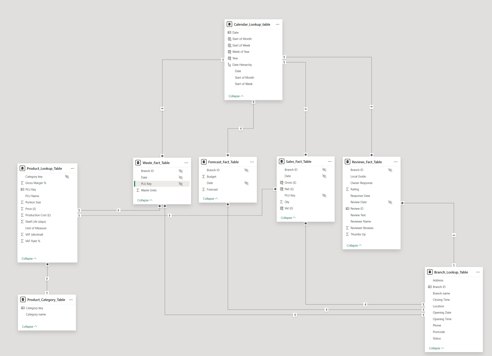
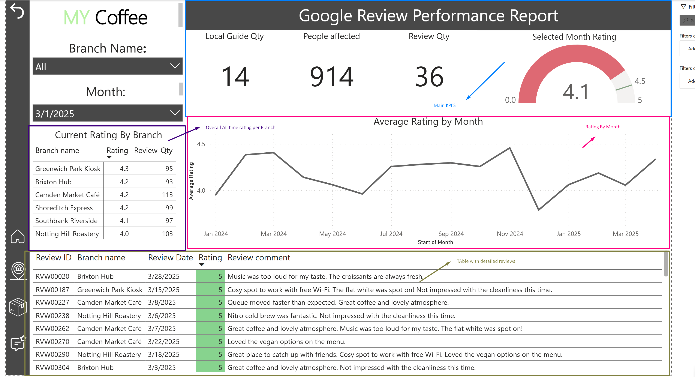

# My Coffee — Sales & Operations Analytics (Power BI)

> Author: **Stanislav Ukrainets**  
> Company (simulated): **My Coffee** (London-based, 6 branches)  
> Data: **Synthetic**, designed to mimic real café operations

  <a href="#-analysis-windows">Analysis Windows</a> •
  <a href="#-project-overview">Overview</a> •
  <a href="#-objectives">Objectives</a> •
  <a href="#-data--scope">Data & Scope</a> •
  <a href="#-modelling-approach">Modelling</a> •
  <a href="#-report-experience-4-pages">Report Pages</a> •
  <a href="#-assumptions--limitations">Assumptions</a> •
  <a href="#-how-to-run">How to Run</a> •
  <a href="#-deliverables--assets">Deliverables</a>

---

##  Analysis Windows
- **Last year:** 1 Jan 2024 – 2 Mar 2024  
- **Current year:** 1 Jan 2025 – 2 Mar 2025

> *Note:* Dates reflect the core portfolio scenario; the dataset is synthetic and illustrative.

---

##  Project Overview
Production-style reporting for **My Coffee** to help managers quickly understand **sales performance**, **branch comparisons**, **product winners/laggards**, **waste drivers**, and **customer reviews**, with **week-over-week** and **same week last year** context.

> *Data are generated to simulate real case work; insights on seasonality, trends, and reviews are illustrative.*

---

##  Objectives
- Provide an **executive Home dashboard** with core KPIs and week/year comparisons.  
- Highlight **top/bottom products** and **waste-driving items** (by category and product).  
- Offer **branch-level performance** views for operational benchmarking.  
- Enable **product deep dives** (price vs demand, underperformers to improve/re-price/retire).  
- Surface **review analytics** (rating trends and detailed feedback).

---

##  Data & Scope

### Tables (8 total)

**Fact tables (4)**
- `Sales_Fact_Table`  
- `Waste_Fact_Table`  
- `Reviews_Fact_Table`  
- `Forecast_Fact_Table`  

> **Decision note:** Forecast is kept separate (not merged into Sales) to avoid mixing observed and predicted data; this keeps measures unambiguous and comparisons explicit.

**Dimension tables (4)**
- `Branch_Lookup_Table`  
- `Product_Lookup_Table`  
- `Product_Category_Table`  
- `Calendar_Dim_Table` *(generated inside Power BI)*

### Sources & Storage
- **CSV:** All fact/lookup tables stored in `/Data` at the repo root.  
- **Calendar:** Generated inside Power BI at refresh (not a CSV).

> **Decision note:** CSVs in `/Data` make the project easy to clone and refresh. A PostgreSQL backend was considered for governance/incremental refresh, but deferred to keep setup friction low.

### Net Sales definition (project-specific)
**Net Sales = Gross Sales − VAT only.**  
No discounts are modeled in this version.

> **Decision note:** Net = Gross − VAT keeps KPI logic transparent in a simulated dataset; promotions/discounts were unnecessary here.

### Week logic
Week comparisons use **week number vs the same week number last year** (Power BI default week numbering; not ISO).

> **Decision note:** Stakeholders usually think “week 32 vs week 32 last year”; ISO was an option but heavier than needed.

---

##  Modelling Approach

### Star schema
Facts connect to dimensions via keys; **single-direction filters** from dimensions to facts (one-to-many). Conformed dimensions (product/category) enable consistent slicing across all facts.

> **Decision note:** Star schema keeps relationships clear, visuals fast, and future facts easy to add (chosen over flat/snowflake for this scope).

### Calendar_Dim_Table (generated in Power BI)
Created at refresh by deriving Min/Max dates from the fact tables and expanding to a full contiguous range. Includes **Year, Quarter, Month, Week Number** (Power BI default), **Day, Week Start**, etc. Enables automatic updates as new data arrives and supports partial-week and same week last year comparisons.

> **Decision note:** Generating the calendar in-model lets it auto-extend to fact Min/Max dates and avoids maintenance for cloners.

### Keys & relationships
- Primary keys set in dimension tables; corresponding foreign keys present in fact tables.  
- Relationship directions are **single** (dimension → fact) to avoid ambiguity and keep evaluation performant.

### Data quality steps
- Standardised headers and data types  
- Removed unnecessary columns  
- Checked for duplicates and nulls

---

##  Report Experience (4 Pages)

### A) Home (Executive Dashboard)
- Branch selector & period controls (week focus).  
- **KPIs:** Gross Sales, Net Sales, Waste %, plus WoW and YoY (same week #).  
- **Gross Sales vs prior year** trend line.  
- **Category matrix** (Gross/Net/Waste %).  
- **Top 10** Bestsellers, **Bottom 10**, **Top 10 by Waste**.

> **Design note:** Lean “KPI → trend → category → top/bottom” flow to front-load the *what*; deeper exploration sits on Product/Branch pages.

### B) Branch
- Compare branches across the selected month/period with core KPIs.  
- Identify strong vs weak performers quickly.

### C) Product
- Product selector with KPIs (**Net Sales, Units, Waste %, Gross Margin, Gross Sales**).  
- **Price adjustment** visual to explore Net Sales scenarios.  
- **Metric selector slicer** + **line chart** for the chosen product.

### D) Reviews
- Average rating & volume (overall/period).  
- **Rating trend** over time.  
- Detailed **reviews table** (rating, comment, branch, date).

**Navigation:** Page buttons in the bottom-left corner; no fixed colour scheme for this version.

> **Design note:** Bottom-left page buttons create consistent muscle memory; heavy theming was skipped to keep focus on numbers.

---

##  Assumptions & Limitations
- Synthetic data limits seasonality, trend fidelity, and review realism.  
- Scope exclusions: labour, promotions, loyalty, and other datasets.  
- No discounts modeled; VAT-only deduction for Net Sales.  
- RLS not planned for this portfolio build.

---

## How to Run
1. **Clone/download** the repository.  
2. Ensure the **`/Data`** folder is present at the project root with the CSV files.  
3. Open **`MyCoffee_Analytics.pbix`** in **Power BI Desktop** (recent version).  
4. If prompted, update the **folder path parameter** to match your machine.  
5. **Refresh** to generate the `Calendar_Dim_Table` and load visuals.

> Measures are discoverable in the PBIX; README stays concise.

---

##  Deliverables & Assets
- **Power BI file:** `MyCoffee_Analytics.pbix`  
- **Data:** `/Data/*.csv`  
- **Model diagram:** `Assets/Images/Model_Schema.png`  
- **Report screenshots:**  
  - `Assets/Images/Home_Page_ Overview.png`  
  - `Assets/Images/Branch_Perfomance_Overview.png`  
  - `Assets/Images/Product_Perfomance_Overview.png`  
